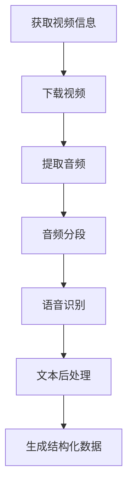

# B站UP主视频内容采集与处理系统

## 1. 项目概述

### 1.1 项目目标
将B站指定UP主的全部视频内容采集并转换为结构化的Markdown格式文本库，为后续大模型训练和问答系统提供数据支持。

### 1.2 核心功能
- B站UP主视频信息采集
- 视频字幕提取与处理
- 视频描述信息提取
- 结构化数据存储
- Markdown格式转换
- 数据质量验证

## 2. 技术方案

### 2.1 技术栈
- 编程语言：Python 3.8+
- 数据采集：bilibili-api-python
- 视频处理：ffmpeg-python
- 视频下载：bilibili-api-python + you-get
- 语音识别：whisper, paddlespeech
- 数据存储：SQLite + JSON
- 文本处理：pandas, numpy
- 异步处理：aiohttp, asyncio
- 测试框架：pytest
- 代码规范：black, pylint

### 2.2 系统架构
```
project/
├── src/
│   ├── collectors/          # 数据采集模块
│   │   ├── bilibili.py     # B站API封装
│   │   └── video.py        # 视频信息采集
│   ├── processors/         # 数据处理模块
│   │   ├── subtitle.py     # 字幕处理
│   │   └── markdown.py     # Markdown转换
│   ├── storage/           # 数据存储模块
│   │   ├── database.py    # 数据库操作
│   │   └── filesystem.py  # 文件系统操作
│   └── utils/             # 工具函数
├── tests/                 # 测试用例
├── data/                  # 数据存储目录
│   ├── raw/              # 原始数据
│   └── processed/        # 处理后数据
├── config/               # 配置文件
└── docs/                 # 文档
```

### 2.3 数据模型
```python
class VideoInfo:
    bvid: str                    # 视频BV号
    title: str                   # 视频标题
    description: str             # 视频描述
    upload_time: datetime        # 上传时间
    duration: int               # 视频时长
    view_count: int             # 播放量
    like_count: int             # 点赞数
    coin_count: int             # 投币数
    favorite_count: int         # 收藏数
    share_count: int            # 分享数
    tags: List[str]             # 视频标签
    subtitles: List[Subtitle]   # 字幕列表

class Subtitle:
    start_time: float           # 开始时间
    end_time: float             # 结束时间
    content: str                # 字幕内容
    speaker: str                # 说话人（如果有）
```

### 2.4 处理流程
1. 数据采集
   - 获取UP主信息
   - 获取视频列表
   - 获取视频详细信息
   - 下载视频文件

2. 音视频处理
   - 视频格式转换
   - 音频提取
   - 音频分段处理
   - 语音识别转文本

3. 数据处理
   - 文本清洗和格式化
   - 时间戳对齐
   - 文本分段处理
   - 元数据提取

4. 数据存储
   - 原始数据备份
   - 结构化数据存储
   - Markdown文件生成

5. 数据验证
   - 完整性检查
   - 格式验证
   - 数据清洗

### 2.5 音视频处理流程


1. 视频下载
   - 使用bilibili-api-python获取视频信息
   - 使用you-get下载视频
   - 支持断点续传
   - 自动重试机制
   - 下载进度监控
   - 清晰度选择
   - 弹幕下载（可选）

2. 音频处理
   - 使用ffmpeg提取音频
   - 音频格式转换
   - 音频质量优化
   - 噪音处理

3. 语音识别
   - 使用Whisper模型进行识别
   - 支持多语言
   - 时间戳对齐
   - 说话人分离（可选）

4. 文本处理
   - 标点符号优化
   - 文本分段
   - 时间戳格式化
   - 文本清洗

### 2.6 存储管理策略
1. 分级存储
   - 热数据：最近处理的视频和音频文件
   - 温数据：已处理但可能需要的原始文件
   - 冷数据：处理完成后的原始文件

2. 存储空间管理
   - 设置存储空间上限
   - 自动清理策略
   - 存储空间预警
   - 数据压缩存储

3. 文件生命周期
   ```
   视频下载 -> 音频提取 -> 语音识别 -> 文本生成 -> 原始文件清理
   ```

### 2.7 批处理策略
1. 任务队列管理
   - 优先级队列
   - 任务状态追踪
   - 失败重试机制
   - 任务依赖管理

2. 资源调度
   - 存储空间监控
   - 计算资源分配
   - 网络带宽控制
   - 并发任务限制

3. 处理流程优化
   - 增量更新机制
   - 断点续传
   - 并行处理
   - 结果缓存

### 2.8 系统配置
```python
class SystemConfig:
    # 存储配置
    max_storage_gb: int = 1000        # 最大存储空间(GB)
    hot_data_retention_days: int = 7  # 热数据保留天数
    temp_dir: str = "data/temp"       # 临时文件目录
    
    # 处理配置
    max_concurrent_downloads: int = 3  # 最大并发下载数
    max_concurrent_processes: int = 2  # 最大并发处理数
    batch_size: int = 10              # 批处理大小
    
    # 清理策略
    cleanup_threshold: float = 0.8    # 清理触发阈值(存储空间使用率)
    retention_policy: Dict[str, int] = {
        "video": 7,                   # 视频文件保留天数
        "audio": 3,                   # 音频文件保留天数
        "temp": 1                     # 临时文件保留天数
    }
```

### 2.9 视频筛选机制
1. 筛选条件
   ```python
   class VideoFilter:
       # 时间范围
       start_date: Optional[datetime] = None
       end_date: Optional[datetime] = None
       
       # 视频属性
       min_duration: Optional[int] = None      # 最小时长(秒)
       max_duration: Optional[int] = None      # 最大时长(秒)
       min_views: Optional[int] = None         # 最小播放量
       min_likes: Optional[int] = None         # 最小点赞数
       
       # 内容过滤
       exclude_keywords: List[str] = []        # 排除关键词
       include_keywords: List[str] = []        # 包含关键词
       exclude_tags: List[str] = []            # 排除标签
       include_tags: List[str] = []            # 包含标签
       
       # 自定义规则
       custom_rules: List[Callable] = []       # 自定义过滤函数
   ```

2. 视频选择方式
   - 手动选择：通过Web界面或命令行交互选择
   - 自动筛选：根据预设规则自动筛选
   - 批量导入：通过CSV/JSON文件导入视频列表
   - 增量更新：只处理新增或更新的视频

3. 视频状态管理
   ```python
   class VideoStatus:
       video_id: str
       status: str  # pending, downloading, processing, completed, failed
       priority: int
       retry_count: int
       last_update: datetime
       error_message: Optional[str]
       processing_history: List[Dict]
   ```

4. 任务管理界面
   - 视频列表展示
   - 状态筛选
   - 批量操作
   - 进度监控
   - 错误处理

### 2.10 配置示例
```python
# 视频筛选配置示例
video_filter_config = {
    "time_range": {
        "start_date": "2024-01-01",
        "end_date": "2024-12-31"
    },
    "video_attributes": {
        "min_duration": 300,  # 5分钟
        "max_duration": 3600,  # 1小时
        "min_views": 1000,
        "min_likes": 100
    },
    "content_filters": {
        "exclude_keywords": ["直播回放", "预告"],
        "include_keywords": ["教程", "讲解"],
        "exclude_tags": ["直播"],
        "include_tags": ["技术", "编程"]
    }
}

# 任务优先级配置
priority_config = {
    "high": {
        "min_views": 10000,
        "min_likes": 1000,
        "keywords": ["重要", "核心"]
    },
    "medium": {
        "min_views": 5000,
        "min_likes": 500
    },
    "low": {
        "min_views": 1000,
        "min_likes": 100
    }
}
```

### 2.11 存储方案设计
1. 存储架构
   ```
   data/
   ├── raw/                    # 原始数据
   │   ├── videos/            # 视频文件
   │   │   └── {bvid}/       # 按BV号组织
   │   │       ├── video.mp4
   │   │       └── metadata.json
   │   └── audio/            # 音频文件
   │       └── {bvid}/      # 按BV号组织
   │           └── audio.wav
   ├── processed/            # 处理后的数据
   │   ├── transcripts/     # 语音识别结果
   │   │   └── {bvid}.json
   │   └── markdown/        # Markdown文件
   │       └── {bvid}.md
   ├── temp/                # 临时文件
   │   ├── downloads/      # 下载缓存
   │   └── processing/     # 处理缓存
   └── database/           # 数据库文件
       └── als.db         # SQLite数据库
   ```

2. 数据库设计
   ```sql
   -- 视频信息表
   CREATE TABLE videos (
       bvid TEXT PRIMARY KEY,
       title TEXT NOT NULL,
       description TEXT,
       upload_time DATETIME,
       duration INTEGER,
       view_count INTEGER,
       like_count INTEGER,
       coin_count INTEGER,
       favorite_count INTEGER,
       share_count INTEGER,
       status TEXT,
       priority INTEGER,
       retry_count INTEGER,
       last_update DATETIME,
       created_at DATETIME DEFAULT CURRENT_TIMESTAMP
   );

   -- 视频标签表
   CREATE TABLE video_tags (
       bvid TEXT,
       tag TEXT,
       FOREIGN KEY (bvid) REFERENCES videos(bvid),
       PRIMARY KEY (bvid, tag)
   );

   -- 处理记录表
   CREATE TABLE processing_records (
       id INTEGER PRIMARY KEY AUTOINCREMENT,
       bvid TEXT,
       stage TEXT,
       status TEXT,
       start_time DATETIME,
       end_time DATETIME,
       error_message TEXT,
       FOREIGN KEY (bvid) REFERENCES videos(bvid)
   );

   -- 存储管理表
   CREATE TABLE storage_management (
       id INTEGER PRIMARY KEY AUTOINCREMENT,
       file_path TEXT,
       file_type TEXT,
       file_size INTEGER,
       last_access DATETIME,
       retention_days INTEGER,
       status TEXT,
       created_at DATETIME DEFAULT CURRENT_TIMESTAMP
   );
   ```

3. 文件存储策略
   ```python
   class StorageManager:
       def __init__(self):
           self.storage_config = {
               "max_storage_gb": 1000,
               "cleanup_threshold": 0.8,
               "retention_policy": {
                   "video": 7,    # 视频文件保留7天
                   "audio": 3,    # 音频文件保留3天
                   "temp": 1      # 临时文件保留1天
               }
           }
           
       def get_file_path(self, bvid: str, file_type: str) -> str:
           """获取文件存储路径"""
           pass
           
       def check_storage_space(self) -> bool:
           """检查存储空间"""
           pass
           
       def cleanup_old_files(self):
           """清理过期文件"""
           pass
           
       def move_to_cold_storage(self, file_path: str):
           """移动到冷存储"""
           pass
   ```

4. 数据备份策略
   - 增量备份
     - 每日备份新增和修改的数据
     - 保留最近30天的增量备份
   - 全量备份
     - 每周进行一次全量备份
     - 保留最近4周的全量备份
   - 备份内容
     - 数据库文件
     - 处理后的Markdown文件
     - 配置文件
     - 元数据文件

5. 存储优化
   - 文件压缩
     - 视频文件：使用H.264编码
     - 音频文件：使用AAC编码
     - 文本文件：使用gzip压缩
   - 存储分层
     - 热数据：SSD存储
     - 温数据：HDD存储
     - 冷数据：压缩存储或云存储
   - 缓存策略
     - 最近访问的文件缓存
     - 处理中的文件缓存
     - 元数据缓存

6. 数据恢复机制
   - 文件恢复
     - 从备份恢复
     - 从临时文件恢复
     - 重新下载处理
   - 数据库恢复
     - 事务日志恢复
     - 备份文件恢复
     - 增量备份恢复

7. 存储监控
   - 空间使用监控
   - 文件访问统计
   - 性能指标监控
   - 异常告警机制

## 3. 输出格式

### 3.1 Markdown文件结构
```markdown
# 视频标题

## 基本信息
- 上传时间：YYYY-MM-DD HH:mm:ss
- 视频时长：XX:XX:XX
- 播放量：XXXXX
- 点赞数：XXXXX
- 投币数：XXXXX
- 收藏数：XXXXX
- 分享数：XXXXX

## 视频标签
- 标签1
- 标签2
- ...

## 视频描述
视频描述内容...

## 字幕内容
### 时间戳 00:00:00
字幕内容...

### 时间戳 00:00:05
字幕内容...

...
```

## 4. 后续规划

### 4.1 大模型集成
- 数据预处理和清洗
- 文本向量化
- 模型微调
- 问答系统开发

### 4.2 系统优化
- 分布式采集
- 增量更新
- 数据备份
- 监控告警

## 5. 注意事项

### 5.1 性能考虑
- 异步并发采集
- 数据缓存机制
- 断点续传
- 限流控制
- GPU加速支持
- 分布式处理
- 任务队列管理

### 5.2 安全考虑
- API访问限制
- 数据加密存储
- 敏感信息过滤
- 访问权限控制

### 5.3 合规性
- 遵守B站API使用规范
- 版权信息保留
- 数据使用授权
- 隐私保护

### 5.2 资源需求
- 存储空间：视频文件 + 音频文件 + 识别结果
- 计算资源：GPU用于语音识别
- 网络带宽：视频下载和上传
- 内存使用：音视频处理
- 存储管理：
  - 自动清理机制
  - 空间预警系统
  - 数据压缩策略
  - 备份恢复机制

### 5.4 性能优化
- 存储优化
  - 文件压缩
  - 增量存储
  - 分布式存储
  - 冷热数据分离
- 处理优化
  - 任务优先级
  - 资源动态分配
  - 失败任务重试
  - 结果缓存复用
- 网络优化
  - 带宽控制
  - 断点续传
  - 并发限制
  - 代理支持

### 5.5 用户交互
- 命令行界面
  - 视频列表浏览
  - 条件筛选
  - 批量选择
  - 状态查看
- Web界面（可选）
  - 视频管理
  - 任务监控
  - 配置管理
  - 数据统计
- 配置文件
  - 筛选规则
  - 处理参数
  - 存储策略
  - 系统设置